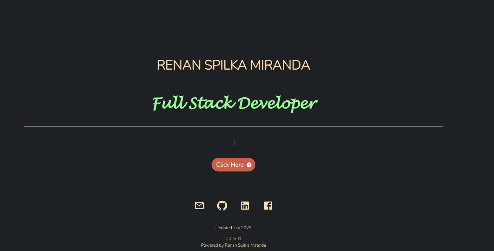

---
  
# Rensn Spilka Miranda Portfolio

  

Table of Contents

  
<ol>
  
<li>
  
<a href="#about">About</a></li>

  
<ul>
  
<li><a href="#built-with">Built With</a></li>

<li><a href="#features">Features</a></li>

<li><a href="#license">License</a></>
  
<li><a href="#contact">Contact</a></>
  
</ol>
  

 ## About

 

This is my personal portfolio to showcase my projects.
<!-- [Click Here to View The Deployed App.](https:///react-portfolio/) -->

(<a href="#top">back to top</a>)</>

 ## Built With
* [React.js](https://reactjs.org/) 
* [MUI](https://mui.com/) 
* [npm packages](https://www.npmjs.com/) 

 (<a href="#top">back to top</a>)</>

 ## Features
* Responsive
* Simple & easy to navigate

<!-- ### Desktop view

### Mobile view 
 -->

 (<a href="#top">back to top</a>)</>

## License

Distributed under MIT License.

See LICENSE.txt for more information.

(<a href="#top">back to top</a>)</>

 ## Contact Me

Renan Spilka Miranda - rs.miranda93@gmail.com

Project Link: [https://github.com/renansm93/React_Portfolio](https://github.com/renansm93/React_Portfolio)

(<a href="#top">back to top</a>)</>
